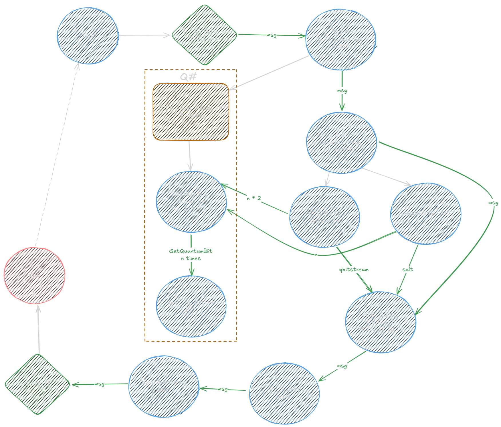

# Quantum Hashing with Python and Q#
Hash messages by utilizing the true randomness of Qubits, by default configured to 256 bits.

## Running the program
To run this program, create a virtual environment and install required packages from `requirements.txt` .  
You will also need the [Quantum Development Kit](https://learn.microsoft.com/en-us/azure/quantum/install-overview-qdk)   

After that just run the `QuantumEncrypt.py` and enter a message to encrypt.

### Explanation
After entering a message we are generating <b>salt</b> and <b>qbitsream</b>, which is a list of random Qubits, either One or Zero. Mapping the stream of Qubits to list of integers makes it easier to work with them.  
Bellow is a flowchart fot easier understanding.   

